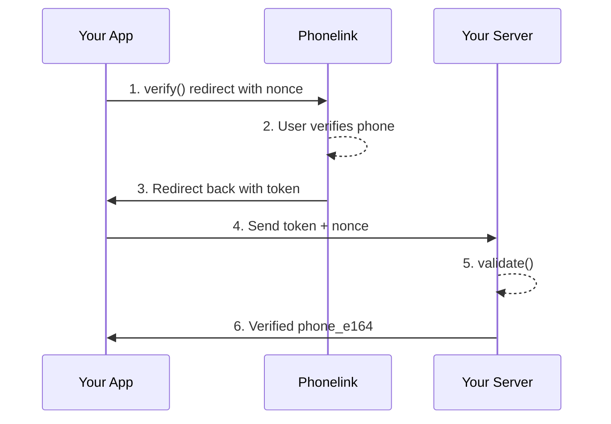

import { Cards, Card } from 'fumadocs-ui/components/card';

## What is Phonelink?

Phonelink is a phone number verification SDK for web and mobile apps. It handles the entire verification flow — your app opens a secure browser session, the user verifies their phone number, and your server validates the resulting signed JWT.

## How it works



1. Your app calls `verify()` which generates a cryptographic nonce and redirects to Phonelink
2. The user completes phone number verification on the Phonelink page
3. Phonelink redirects back to your app with a signed JWT token
4. Your app sends the token and nonce to your server
5. Your server calls `validate()` to validate the JWT signature, issuer, audience, nonce, and verification status
6. On success, your server receives the verified phone number in E.164 format

## Install

```bash
npm install phonelink
```

## Choose your platform

<Cards>
  <Card title="Web (Vanilla JS)" href="/web/vanilla" description="Redirect-based flow for any web app" />
  <Card title="React" href="/web/react" description="usePhonelink hook for React apps" />
  <Card title="Expo" href="/expo" description="In-app browser flow for React Native" />
  <Card title="iOS" href="/ios" description="Native Swift SDK for iOS apps" />
</Cards>

## Server verification

Every integration requires server-side token verification. See the [Server Verification](/validate) guide after setting up your client.
