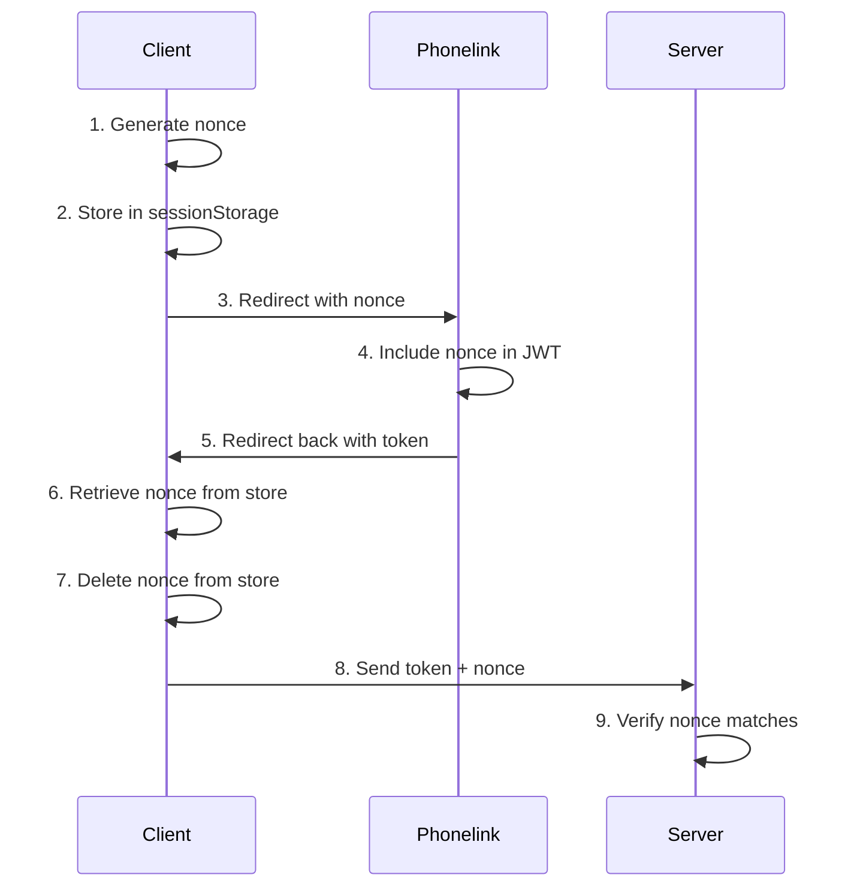

## Security model

Phonelink uses **signed JWTs** (JSON Web Tokens) and **cryptographic nonces** to ensure phone verification results are authentic, untampered, and non-replayable.

## JWT verification

Every verification result is a JWT signed by Phonelink's private keys. Your server verifies the signature using the public keys published at the JWKS endpoint:

```
https://phone.link/.well-known/jwks.json
```

The `validate` function handles this automatically using the [`jose`](https://github.com/panva/jose) library. It:

1. Fetches and caches the public keys from the JWKS endpoint
2. Verifies the JWT signature against the cached keys
3. Validates the `iss` (issuer) claim is `https://phone.link`
4. Validates the `aud` (audience) claim matches your client ID
5. Checks the token has not expired (via the `exp` claim)

Key rotation is handled transparently. The `jose` library automatically refetches the JWKS when it encounters an unknown key ID.

## Nonce validation

The nonce prevents **replay attacks** — an attacker intercepting a valid token cannot reuse it.

### Nonce lifecycle



**Why this works:**
- The nonce is generated by the client and stored locally (never sent to Phonelink in a way that could be intercepted and reused without the storage)
- Phonelink embeds it in the signed JWT, so it can't be altered
- The server checks that the nonce from the client matches the nonce in the token
- An attacker would need both the token AND access to the victim's `sessionStorage` to replay the verification

### Single-use guarantee

On the web, the nonce is removed from `sessionStorage` immediately after `getResult()` reads it. This means:
- Refreshing the callback page returns `null` (the nonce is gone)
- Each verification flow uses a unique nonce
- Old tokens cannot be replayed even if intercepted

On Expo, the nonce is held in memory for the duration of the `verify()` call and is never persisted to disk.

## Audience validation

The `aud` (audience) claim in the JWT is set to your client ID. The server checks this to ensure the token was issued for your application specifically.

This prevents **token misuse** across different Phonelink clients. A token issued for `client-A` will fail verification when checked against `client-B`.

## Token expiry

Tokens have a limited lifetime enforced via the `exp` claim. The `jose` library automatically rejects expired tokens during verification. You do not need to check expiry manually.

## Best practices

### Always verify server-side

Never verify tokens in client-side code. The web client (`phonelink/web`) intentionally does not verify JWTs — it only passes the raw token to your server. All cryptographic validation must happen on your server using `phonelink/validate`.

### Always validate the nonce

Always forward the nonce from the client to your server alongside the token. Never skip nonce validation, even in development. The `validate` function requires the nonce as a parameter and will throw if it doesn't match.

### Use HTTPS

Ensure your callback URL and server endpoints use HTTPS. This prevents token interception in transit.

### Don't store tokens long-term

Phonelink tokens are short-lived and single-purpose. Extract the phone number (`phone_e164`) from the verified payload and store that in your database. Don't store the raw JWT.

### Validate before trusting

Don't extract claims from the JWT without verification. Always call `validate` first. Only use properties from the returned `PhonelinkPayload` object.
